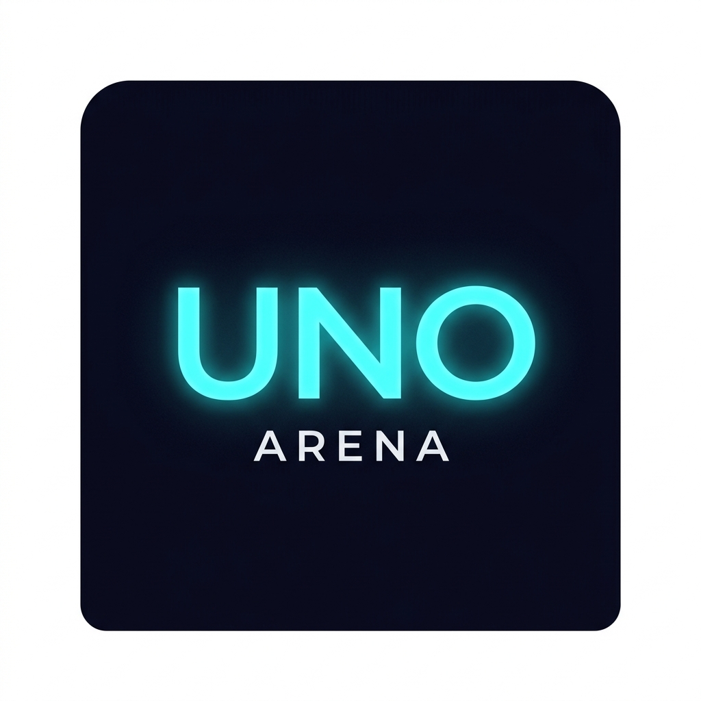

<div align="center">

# 🎴 UNO Arena

### The classic card game — fully offline, no internet needed.
### Play with friends over Wi-Fi or challenge AI bots.

[](https://expo.dev/accounts/sweetboypuku/projects/uno-arena)
[](https://expo.dev)
[](https://reactnative.dev)
[](https://typescriptlang.org)
[](LICENSE)

<br/>



</div>

---

## 📖 What is UNO Arena?

UNO Arena is a **fully offline multiplayer UNO card game** built with React Native. No account, no internet, no server — just your phone and your friends on the same Wi-Fi network or hotspot.

- 🤝 **Local multiplayer** — up to 4 players connected over Wi-Fi/hotspot via TCP sockets
- 🤖 **vs Bots** — 3 AI difficulty levels (Easy, Medium, Hard)
- 🃏 **Multiple game modes** — Classic, Blitz, and UNO Flip
- 🏠 **House rules** — Stacking, Jump-In, 7-0 rule, Force Play, and more
- 🏆 **Achievements & Stats** — Track your win streak, score history, and unlock badges

---

## 🎮 How to Play

### Objective

Be the **first player to empty your hand** each round. Score points from opponents' leftover cards. First to reach **500 points** wins the match.

### Setup

Each player is dealt **7 cards**. The top card of the remaining deck is flipped to start the discard pile. Play goes clockwise by default.

### On Your Turn

1. **Play a card** — Tap any highlighted (glowing) card in your hand. It must match the top discard card by **colour** or **value**, or be a Wild card.
2. **Draw a card** — If you have no playable card, tap the draw pile. You may then play the drawn card if it matches.
3. **Pass** — If the drawn card isn't playable, tap **Pass** to end your turn.

### Calling UNO!

When you have **2 cards left**, tap the **UNO!** button **before** playing down to 1 card. If another player catches you with 1 card and no UNO call, you draw a 2-card penalty!

### Action Cards

| Card | Effect |
|------|--------|
| **Skip** | Next player loses their turn |
| **Reverse** | Direction of play flips (in a 2-player game, acts as Skip) |
| **Draw +2** | Next player draws 2 cards and is skipped |
| **Wild** | Play any time — you choose the next active colour |
| **Wild Draw +4** | Next player draws 4 cards, you choose the colour |

### UNO Flip Mode — Extra Cards

| Card | Effect |
|------|--------|
| **Flip** | Flips all cards to the dark side — harsher rules apply |
| **Skip Everyone** | Current player plays again; everyone else is skipped |
| **Draw +5** | Next player draws 5 cards and is skipped |

### Blitz Mode

Each player has a **10-second timer** per turn. Run out of time and you automatically draw a card!

### Scoring

The round winner scores the sum of all remaining cards in opponents' hands:

| Card | Points |
|------|--------|
| Number cards (1–9) | Face value |
| Skip / Reverse / Draw +2 | 20 pts |
| Wild / Wild Draw +4 | 50 pts |
| Flip / Skip Everyone | 20–30 pts |
| Draw +5 | 40 pts |

---

## 🏠 House Rules

Toggle these in **Settings → House Rules** before starting:

| Rule | Description |
|------|-------------|
| **Stacking** | Chain Draw +2 / +4 cards — next player must stack or draw the full pile |
| **Jump-In** | Play an identical card (same colour + value) out of turn to steal the round |
| **7-0 Rule** | Play a 7 to swap hands with any player; play a 0 to rotate all hands |
| **Force Play** | If you drew a playable card, you must play it immediately |
| **Draw Until Play** | Keep drawing until you pick up a card you can play |
| **No Bluffing** | Wild Draw +4 can be challenged — if you had a valid card, you draw 4 instead |

---

## 🌐 Multiplayer (Wi-Fi / Hotspot)

UNO Arena connects players **directly on your local network** — zero internet required.

### Host a Game

1. Open the app → **Play** → **Lobby** → **Host Game**
2. Your device's local IP address appears on screen
3. Share it with your friends

### Join a Game

1. Open the app → **Play** → **Lobby** → **Join Game**
2. Enter the host's IP address
3. Tap **Join** — you're in instantly

> 💡 **No Wi-Fi?** One player can turn on a **mobile hotspot**. Others connect to it, then host/join as normal.

---

## 🤖 AI Difficulty Levels

| Level | Behaviour |
|-------|-----------|
| **Easy** | Plays the first valid card. Picks wild colours randomly. Forgets to call UNO ~40% of the time. |
| **Medium** | Prefers high-value number cards, saves wilds, picks strategic colours. Calls UNO 85% of the time. |
| **Hard** | Tracks the most dangerous opponent, deploys action cards at critical moments, always calls UNO. Near-optimal play. |

---

## 🏆 Achievements

| Badge | Condition |
|-------|-----------|
| 🏆 First Blood | Win your first game |
| 🤖 Bot Slayer | Win 5 games against bots |
| 🦈 Card Shark | Play 100 games total |
| 👑 UNO Master | Win 10 games |
| ⚡ Speed Demon | Win a Blitz mode game |
| 🔄 Flip Wizard | Win a Flip mode game |
| 🔥 Hot Streak | Win 3 games in a row |
| 💰 High Roller | Accumulate 1000 total score |
| ✨ Perfectionist | Win without drawing a single card |
| 🦋 Social Butterfly | Play 10 multiplayer games |

---

## 📱 Download

**Android APK (Preview Build):**

> 👉 [expo.dev/accounts/sweetboypuku/projects/uno-arena/builds](https://expo.dev/accounts/sweetboypuku/projects/uno-arena/builds)

Download the latest `.apk`, transfer it to your Android phone, and tap to install. If prompted, enable **"Install from unknown sources"** in your Android settings (Settings → Apps → Special app access).

---

## 🛠️ Tech Stack

| Layer | Technology |
|-------|-----------|
| Framework | [React Native](https://reactnative.dev) 0.85 + [Expo](https://expo.dev) 56 |
| Language | [TypeScript](https://typescriptlang.org) 6.0 |
| Navigation | [React Navigation](https://reactnavigation.org) v7 — Stack navigator |
| State Management | [Zustand](https://zustand-demo.pmnd.rs) v5 with `persist` middleware |
| Persistence | [@react-native-async-storage](https://react-native-async-storage.github.io/async-storage/) v3 |
| Networking | [react-native-tcp-socket](https://github.com/Rapsssito/react-native-tcp-socket) — raw TCP over LAN |
| Animations | [react-native-reanimated](https://docs.swmansion.com/react-native-reanimated/) v4 + react-native-worklets |
| Graphics | [react-native-svg](https://github.com/software-mansion/react-native-svg) v15 |
| Haptics | [expo-haptics](https://docs.expo.dev/versions/latest/sdk/haptics/) |
| Unique IDs | [uuid](https://github.com/uuidjs/uuid) v9 |
| Build & Distribution | [EAS Build](https://docs.expo.dev/build/introduction/) |
| Testing | [Jest](https://jestjs.io) 29 + [jest-expo](https://github.com/expo/expo/tree/main/packages/jest-expo) |

---

## 🏗️ Project Structure

```
UNO-Arena/
├── App.tsx                         # Root component
├── index.ts                        # Entry point
├── app.json                        # Expo app configuration
├── eas.json                        # EAS Build profiles (preview APK, production AAB)
├── babel.config.js
├── tsconfig.json
├── package.json
│
├── assets/                         # App icons, splash screen
│
└── src/
    ├── AppNavigator.tsx            # Root stack navigator
    │
    ├── screens/                    # Full-screen views
    │   ├── OnboardingScreen.tsx    # First-launch: name + avatar picker
    │   ├── HomeScreen.tsx          # Main menu
    │   ├── GameModeScreen.tsx      # Mode selector (Classic/Blitz/Flip/Custom)
    │   ├── LobbyScreen.tsx         # Host / Join / vs Bots setup
    │   ├── GameScreen.tsx          # Main game table (the battlefield)
    │   ├── ResultsScreen.tsx       # Round/game results
    │   ├── StatsScreen.tsx         # Match history & achievements
    │   ├── ProfileScreen.tsx       # Avatar & name editor
    │   ├── SettingsScreen.tsx      # Sound, haptics, house rules
    │   └── HowToPlayScreen.tsx     # In-app tutorial
    │
    ├── game/                       # Pure game logic (zero React dependencies)
    │   ├── deck.ts                 # Deck creation, Fisher-Yates shuffle, dealing
    │   ├── actions.ts              # Card play validation & effect resolution
    │   ├── engine.ts               # Game state machine (play, draw, UNO, scoring)
    │   ├── ai.ts                   # Bot decision engine (Easy / Medium / Hard)
    │   └── index.ts                # Re-exports
    │
    ├── store/                      # Zustand global state stores
    │   ├── gameStore.ts            # Active game state + action dispatchers
    │   ├── playerStore.ts          # Player profile (persisted to AsyncStorage)
    │   ├── networkStore.ts         # Connection state (IP, host/client, errors)
    │   ├── settingsStore.ts        # Game settings & house rules (persisted)
    │   └── statsStore.ts           # Match history & achievements (persisted)
    │
    ├── network/
    │   └── NetworkManager.ts       # TCP socket host/client manager + message router
    │
    ├── components/
    │   ├── cards/
    │   │   └── UnoCard.tsx         # Animated card renderer (scale + glow effects)
    │   └── game/
    │       ├── ColorPicker.tsx     # Wild colour selection modal
    │       └── EmojiBar.tsx        # Emoji reactions + floating pop-up animations
    │
    ├── constants/
    │   ├── theme.ts                # Colours, fonts, spacing, border radii, shadows
    │   └── cards.ts                # Card labels, avatar list, bot names
    │
    ├── types/
    │   ├── game.ts                 # All game type definitions
    │   └── network.ts              # TCP message protocol types
    │
    ├── utils/
    │   └── sounds.ts               # Haptics manager + sound effect stubs
    │
    └── __tests__/                  # Jest test suites (90+ tests)
        ├── deck.test.ts
        ├── actions.test.ts
        ├── engine.test.ts
        └── ai.test.ts
```

---

## 📡 Network Protocol

Multiplayer uses **newline-delimited JSON** over raw TCP on port **7070**:

```
Host ──┬── GAME_STATE   ──► All Clients   (authoritative state after every action)
       ├── JOIN_ACK     ──► Joining Client (connection confirmed + assigned ID)
       └── CHAT_MESSAGE ──► All Clients   (emoji reactions forwarded)

Client ─┬── JOIN_REQUEST  ──► Host
        └── PLAYER_ACTION ──► Host        (PLAY_CARD / DRAW_CARD / CALL_UNO / PASS)
```

The **Host device is the single source of truth**. All client actions are sent to the Host, the Host runs the game engine, and broadcasts the new `GameState` to everyone. Clients never mutate state directly.

---

## 🚀 Developer Setup

### Prerequisites

- [Node.js](https://nodejs.org) 18+
- [Expo Go](https://expo.dev/go) on your phone (for quick testing)
- An [Expo account](https://expo.dev/signup) (only needed for EAS builds)

### Install & Run

```bash
# 1. Clone
git clone https://github.com/parvatkhattak/UNO-Arena.git
cd UNO-Arena

# 2. Install dependencies
npm install --legacy-peer-deps

# 3. Start Metro bundler (clears cache)
npx expo start --clear
```

Scan the QR code with **Expo Go** on your phone, or press `a` for Android emulator / `i` for iOS simulator.

### Run Tests

```bash
npm test
```

90+ unit tests covering: deck creation, card validation, game engine state transitions, AI decision logic.

### Build APK (via EAS)

```bash
# Log in to Expo
npx eas login

# Preview build — produces a .apk file
npm run build:android:preview

# Production build — produces a .aab for the Play Store
npm run build:android:prod
```

---

## 🐛 Bugs Fixed

| # | Bug | Fix Applied |
|---|-----|------------|
| 1 | TCP messages never parsed — `'\\n'` (literal 2-char string) used instead of real `'\n'` newline | Fixed delimiter in `NetworkManager.ts` |
| 2 | App crash on start — `uuid` v14 removed the named `v4` export | Downgraded to `uuid@9` |
| 3 | `react-native-reanimated` v4 missing peer dep `react-native-worklets` | Installed `react-native-worklets` |
| 4 | Bots always passing after drawing, even if the card was playable | Added playability check before `passTurnAction` |
| 5 | `draw2`/`wild_draw4` skipping 2 players instead of 1 in non-stacking mode | Fixed `skip` arg in `getNextPlayerIndex` |
| 6 | NaN scores when `p.score` is `undefined` on AsyncStorage rehydration | Changed `||` to `??` nullish coalescing |

---

## 📄 License

[MIT](LICENSE) © 2026 Parvat Khattak
