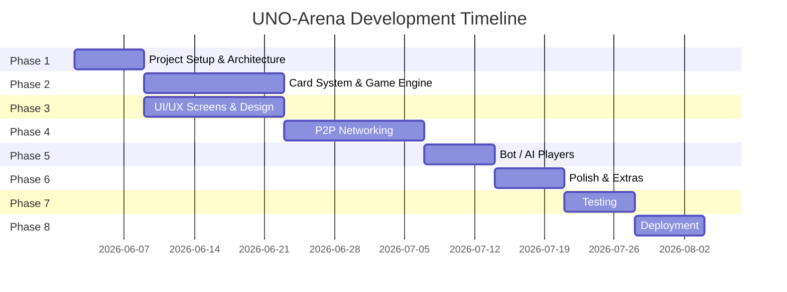

# 🎴 UNO-Arena — Master Plan

## Problem Statement

When traveling to remote areas, we often:
- Don't have physical UNO cards available
- Have little or no mobile data / internet signal
- Still want to play multiplayer games with friends nearby

**UNO-Arena** solves this by providing a fully **offline multiplayer UNO game** that connects players via **local WiFi hotspot/LAN** or **Bluetooth** — no internet required.

---

## Tech Stack

| Layer | Technology | Why |
|:---|:---|:---|
| **Framework** | React Native (Expo bare workflow) | Cross-platform (iOS + Android), rich ecosystem, fast development |
| **Language** | TypeScript | Type safety for complex game logic |
| **Navigation** | React Navigation v7 | Industry standard, smooth transitions |
| **State Management** | Zustand | Lightweight, perfect for real-time game state |
| **Local Database** | WatermelonDB or AsyncStorage | Player profiles, stats, settings persistence |
| **Animations** | React Native Reanimated 3 + Lottie | Smooth card animations, UNO effects |
| **Audio** | expo-av | Sound effects, background music |
| **P2P Networking** | `react-native-wifi-p2p` (Android WiFi Direct) + `react-native-multipeer` (iOS) + TCP Sockets (`react-native-tcp-socket`) | Offline device-to-device connectivity |
| **Bluetooth** | `react-native-ble-plx` | Short-range fallback connectivity |
| **Icons/Assets** | Custom SVG card designs + `react-native-svg` | Crisp, scalable UNO card graphics |

---

## Game Modes Supported

### 1. 🃏 Classic UNO
- Standard rules: match by color, number, or symbol
- Action cards: Skip, Reverse, Draw 2, Wild, Wild Draw 4
- 2–10 players
- "UNO!" call mechanic with penalty

### 2. 🔄 UNO Flip
- Double-sided cards (Light side & Dark side)
- Flip card flips the entire game
- Dark side has harsher penalties (Draw 5, Skip Everyone)

### 3. ⚡ UNO Blitz (Speed Mode)
- Timed turns (10-second countdown)
- No pausing, fast-paced action
- Perfect for quick rounds

### 4. 🏠 Custom / House Rules
- Players can toggle custom rules before starting:
  - **Stacking**: Chain Draw 2 / Draw 4 cards
  - **Jump-In**: Play identical card out of turn
  - **7-0 Rule**: 7 = swap hands with a player, 0 = rotate all hands
  - **No Bluffing**: Wild Draw 4 can be challenged
  - **Draw Until You Can Play**: Keep drawing until a playable card appears

---

## Development Phases

---

### 📌 Phase 1: Project Setup & Architecture (Week 1)

| # | Task | Details |
|:--|:-----|:--------|
| 1.1 | Initialize React Native project | Expo bare workflow with TypeScript template |
| 1.2 | Set up folder structure | See architecture below |
| 1.3 | Configure ESLint, Prettier | Code quality & consistency |
| 1.4 | Install core dependencies | Navigation, state management, animation libs |
| 1.5 | Set up navigation skeleton | Stack navigator with placeholder screens |
| 1.6 | Create global theme/design system | Colors, typography, spacing tokens |

**Folder Structure:**
```
UNO-Arena/
├── src/
│   ├── assets/          # Images, sounds, fonts, card SVGs
│   ├── components/      # Reusable UI components
│   │   ├── cards/       # Card components (UnoCard, CardFan, etc.)
│   │   ├── game/        # Game-specific UI (scoreboard, turn indicator)
│   │   └── common/      # Buttons, modals, inputs
│   ├── screens/         # App screens
│   │   ├── HomeScreen
│   │   ├── LobbyScreen
│   │   ├── GameScreen
│   │   ├── SettingsScreen
│   │   └── ProfileScreen
│   ├── game/            # Core game engine
│   │   ├── engine.ts        # Game loop, turn management
│   │   ├── rules.ts         # UNO rules (classic, flip, blitz)
│   │   ├── deck.ts          # Deck creation, shuffling
│   │   ├── actions.ts       # Card play validation, effects
│   │   └── ai.ts            # Bot player logic (for practice)
│   ├── network/         # P2P networking layer
│   │   ├── host.ts          # Host/server logic
│   │   ├── client.ts        # Client/joiner logic
│   │   ├── protocol.ts      # Message types & serialization
│   │   ├── discovery.ts     # Device discovery (WiFi/BT)
│   │   └── sync.ts          # State synchronization
│   ├── store/           # Zustand stores
│   │   ├── gameStore.ts
│   │   ├── playerStore.ts
│   │   └── settingsStore.ts
│   ├── hooks/           # Custom React hooks
│   ├── utils/           # Helper functions
│   ├── types/           # TypeScript type definitions
│   └── constants/       # App constants, card definitions
├── android/
├── ios/
├── app.json
├── tsconfig.json
└── package.json
```

---

### 📌 Phase 2: Card System & Game Engine (Week 2-3)

| # | Task | Details |
|:--|:-----|:--------|
| 2.1 | Define card data models | Color, number, type (action/wild), side (for Flip) |
| 2.2 | Build deck generator | Create 108-card standard deck, shuffle algorithm (Fisher-Yates) |
| 2.3 | Design card SVG assets | All 108 cards with vibrant, modern design |
| 2.4 | Build `<UnoCard>` component | Animated card with flip, hover, play effects |
| 2.5 | Implement card play validation | Match by color/number/symbol, wild card logic |
| 2.6 | Build game engine core | Turn management, direction, draw pile, discard pile |
| 2.7 | Implement action card effects | Skip, Reverse, Draw 2, Wild, Wild Draw 4 |
| 2.8 | Add "UNO!" call mechanic | Tap to call UNO, penalty for forgetting (draw 2) |
| 2.9 | Implement scoring system | Points based on opponents' remaining cards |
| 2.10 | Add UNO Flip rules | Dual-sided deck, flip mechanic, dark side actions |
| 2.11 | Add Blitz mode timer | 10-second turn countdown with auto-draw |
| 2.12 | Add house rules toggles | Stacking, Jump-In, 7-0 Rule, etc. |
| 2.13 | Build basic AI opponent | Simple bot for solo practice (play valid card or draw) |

---

### 📌 Phase 3: UI/UX — Screens & Design (Week 3-4)

| # | Task | Details |
|:--|:-----|:--------|
| 3.1 | **Home Screen** | Animated logo, play button, profile access, settings |
| 3.2 | **Profile Screen** | Avatar selection, username, win/loss stats |
| 3.3 | **Game Mode Selection** | Choose Classic / Flip / Blitz / Custom with descriptions |
| 3.4 | **Lobby Screen** | Host or Join game, see connected players, room code |
| 3.5 | **Game Screen** | The main battlefield — card fan, discard pile, opponents' cards, turn indicator |
| 3.6 | **Settings Screen** | Sound, haptics, theme (dark/light), house rules presets |
| 3.7 | **Results Screen** | Winner celebration, scores breakdown, play again button |
| 3.8 | Design micro-animations | Card play, draw, shuffle, UNO call, turn transitions |
| 3.9 | Add haptic feedback | Vibration on card play, UNO call, penalty |
| 3.10 | Implement sound effects | Card flip, shuffle, UNO shout, win/lose jingles |

**UI Design Principles:**
- 🌑 **Dark theme by default** (easier on eyes during travel)
- 🎨 **Vibrant neon accents** on dark backgrounds (gaming aesthetic)
- 🃏 **Large, readable cards** optimized for mobile
- ✨ **Glassmorphism** for modals and overlays
- 🔥 **Particle effects** for UNO calls and wins

---

### 📌 Phase 4: P2P Networking — Offline Multiplayer (Week 4-6)

> [!IMPORTANT]
> This is the most critical and complex phase. The entire value proposition depends on reliable offline connectivity.

| # | Task | Details |
|:--|:-----|:--------|
| 4.1 | Design networking protocol | Define message types: `JOIN`, `READY`, `PLAY_CARD`, `DRAW`, `UNO_CALL`, `GAME_STATE`, etc. |
| 4.2 | Implement WiFi hotspot discovery | One device creates hotspot, others connect to it |
| 4.3 | Implement TCP socket server (Host) | Host device runs a lightweight TCP server |
| 4.4 | Implement TCP socket client (Joiner) | Joiners connect to host's TCP server |
| 4.5 | Build message serialization | JSON-based protocol with message validation |
| 4.6 | Implement game state sync | Host is authoritative; broadcasts state to all clients |
| 4.7 | Add Bluetooth connectivity | Fallback when WiFi is unavailable |
| 4.8 | Handle disconnection/reconnection | Graceful handling when a player drops and returns |
| 4.9 | Implement lobby system over network | Show connected players, ready status, start game |
| 4.10 | Add latency compensation | Buffer for slight delays in local network |
| 4.11 | Security: prevent cheating | Host validates all moves; clients can't forge plays |

**Networking Architecture:**

```
┌─────────────┐         TCP/BT          ┌─────────────┐
│  HOST DEVICE │◄──────────────────────►│  PLAYER 2   │
│  (Server)    │                         └─────────────┘
│              │         TCP/BT          ┌─────────────┐
│  - Game      │◄──────────────────────►│  PLAYER 3   │
│    Engine    │                         └─────────────┘
│  - State     │         TCP/BT          ┌─────────────┐
│    Authority │◄──────────────────────►│  PLAYER 4   │
│              │                         └─────────────┘
└─────────────┘
        ▲
        │ All game logic runs on Host
        │ Clients send ACTIONS (play card, draw, call UNO)
        │ Host validates & broadcasts updated GAME STATE
```

**Protocol Message Examples:**
```typescript
// Client → Host
{ type: "PLAY_CARD", payload: { cardId: "red_7", playerId: "p2" } }
{ type: "DRAW_CARD", payload: { playerId: "p2" } }
{ type: "CALL_UNO",  payload: { playerId: "p2" } }

// Host → All Clients
{ type: "GAME_STATE", payload: { 
    currentPlayer: "p3",
    discardTop: { color: "red", value: "7" },
    playerHands: { p1: 5, p2: 3, p3: 7, p4: 1 }, // only counts
    yourHand: [...cards],  // each client gets their own hand
    direction: "clockwise",
    drawPileCount: 42
}}
```

---

### 📌 Phase 5: Bot / AI Players (Week 6-7)

| # | Task | Details |
|:--|:-----|:--------|
| 5.1 | **Easy Bot** | Plays first valid card found, random wild color |
| 5.2 | **Medium Bot** | Prefers action cards, picks strategic wild colors |
| 5.3 | **Hard Bot** | Tracks played cards, saves action cards, predicts opponents |
| 5.4 | Allow mixed games | Human + Bot players in the same game |
| 5.5 | Bot turn delay | Simulated "thinking" time for natural feel |

---

### 📌 Phase 6: Polish & Extra Features (Week 7-8)

| # | Task | Details |
|:--|:-----|:--------|
| 6.1 | In-game chat / emojis | Quick reactions during gameplay |
| 6.2 | Player avatars & customization | Select from preset avatars |
| 6.3 | Achievement system | "First Win", "UNO Streak", "Card Shark", etc. |
| 6.4 | Match history | Log of past games with stats |
| 6.5 | Tutorial / How to Play | Interactive walkthrough for new players |
| 6.6 | Onboarding flow | First-launch experience with name + avatar setup |
| 6.7 | App icon & splash screen | Branded, polished launch experience |
| 6.8 | Performance optimization | Reduce bundle size, optimize animations |
| 6.9 | Accessibility | Screen reader support, colorblind-friendly card design |

---

### 📌 Phase 7: Testing (Week 8-9)

| # | Task | Details |
|:--|:-----|:--------|
| 7.1 | Unit tests — Game engine | Test all rules, edge cases, scoring |
| 7.2 | Unit tests — Card validation | Every card combination tested |
| 7.3 | Integration tests — Networking | Multi-device connection scenarios |
| 7.4 | E2E tests — Full game flow | Home → Lobby → Game → Results |
| 7.5 | Real-device testing | Test on 4+ physical devices simultaneously |
| 7.6 | Edge case testing | Disconnections, rapid card plays, empty deck recycling |
| 7.7 | Performance testing | Memory usage, battery drain, animation FPS |

---

### 📌 Phase 8: Deployment (Week 9-10)

| # | Task | Details |
|:--|:-----|:--------|
| 8.1 | Generate production builds | Android APK/AAB + iOS IPA |
| 8.2 | App Store assets | Screenshots, descriptions, keywords |
| 8.3 | Submit to Google Play Store | Android release |
| 8.4 | Submit to Apple App Store | iOS release |
| 8.5 | Set up crash reporting | Sentry or Firebase Crashlytics |
| 8.6 | Create landing page / website | Simple page for app download links |

---

## Execution Order Summary



---

## Key Design Decisions

| Decision | Choice | Rationale |
|:---------|:-------|:----------|
| **Host-authoritative model** | Host device runs all game logic | Prevents cheating, single source of truth |
| **TCP over UDP** | TCP sockets for game data | UNO is turn-based, reliability > speed |
| **JSON protocol** | JSON messages over sockets | Human-readable, easy to debug, fast enough for card games |
| **React Native** over Flutter | React Native | JavaScript ecosystem, easier P2P library access, wider community |
| **Zustand** over Redux | Zustand | Less boilerplate, perfect for real-time game state |
| **Dark theme default** | Dark mode | Better for low-light travel environments |

---

## Risk Assessment

| Risk | Impact | Mitigation |
|:-----|:-------|:-----------|
| WiFi Direct inconsistency across Android OEMs | High | Fallback to WiFi hotspot + TCP sockets as primary method |
| iOS P2P restrictions | Medium | Use Multipeer Connectivity framework (Apple's official P2P) |
| Bluetooth bandwidth limitations | Low | Bluetooth as fallback only; WiFi is primary |
| Complex state sync bugs | High | Host-authoritative model; comprehensive unit tests |
| Card animation performance | Medium | Use Reanimated 3 (runs on UI thread); optimize SVGs |

---

## Open Questions

> [!IMPORTANT]
> **Target platforms?** Should we target Android only first (simpler P2P), or both iOS + Android from day one?

> [!IMPORTANT]  
> **Primary connectivity method?** WiFi hotspot (one phone creates hotspot, others join) is the most reliable approach. Should we prioritize this over WiFi Direct?

> [!NOTE]
> **Online mode in future?** Should we architect the networking layer to support an optional online mode (via internet server) in a future update?

---

## Ready to Start?

Once you approve this plan, we'll begin with **Phase 1: Project Setup & Architecture**.

> [!NOTE]
> Each phase will be tracked in a `task.md` file with checkboxes. We'll move step by step through each phase, testing as we go.
